<div align="center">

<!-- 🎬 BANNIÈRE ANIMÉE -->
<video width="100%" height="200" autoplay loop muted playsinline>
  <source src="https://user-images.githubusercontent.com/TA_ID/VIDEO_URL.mp4" type="video/mp4">
  Votre bannière personnalisée ici
</video>

# 👋 **Bonjour, moi c'est Mesmin !**  
*Data Analyst | Modélisation & Visualisation | Data-Driven 🚀*

[](https://github.com/MesminRandhal)

</div>

---

## 🔥 **Projets Phares**

### 🔋 **Analyse Enedis - Power BI Dashboard** 

*⚡ **Contexte :** Analyse des Diagnostics de Performance Énergétique (DPE) dans le Rhône. Création d'un dashboard interactif permettant d'identifier les consommations énergétiques, les coûts et les typologies de logements.*

<div align="center">


</div>

**📊 Résultats Power BI :**  
**🔢 Nombre total de DPE : 159,47K**  
**🔥 Consommation chauffage à Lyon : 450,01M kWh**  
**💡 Coût éclairage à Lyon : 2,21M€**  
**🔥 Coût chauffage total : 331,02M€**  

**🛠️ Stack :** Power BI | DAX | Python | Pandas  
**🔗** [Voir le projet](https://github.com/Bergkamp102006/iut_sd2_powerbi_enedis)

---

### 📊 **Tableau de Bord Dynamique – DPE du Rhône**

<div align="center">

</div>

**📈 Analyses disponibles :**  
- Répartition **DPE (A à G)**  
- Consommation par **type de bâtiment**  
- Comparaison **coûts énergétiques**  
- Évolution **coût chauffage Villeurbanne**  

---

### 🗺️ **Analyse Géospatiale – Stations d'épuration**

*🌍 **Contexte :** Visualisation des stations d'épuration du bassin Rhône Méditerranée Corse avec analyse des capacités et densité infrastructurelle.*

<div align="center">

</div>

**📌 Caractéristiques :**  
- **Capacités en Équivalent Habitants**  
- **Limites administratives/hydrologiques**  
- **Zones à forte densité**  

**🛠️ Stack :** QGIS | R | Shiny | Cartographie spatiale

---

### 📊 **Tableau de Bord Power BI Interactif**

<div align="center">
<video width="100%" height="300" autoplay loop muted playsinline>
  <source src="https://github.com/YOUR_USERNAME/YOUR_PROJECT2/raw/main/dashboard-demo.mp4" type="video/mp4">
</video>
</div>

**🎯 KPI Business | Visualisations dynamiques**

---

## 🛠️ **Tech Stack Animé**

```mermaid
graph TD
    A[🐍 Python] --> B[📊 Pandas/Plotly]
    C[⚡ Power BI] --> D[📈 Dashboards]
    E[🗺️ QGIS/R] --> F[🌍 Géospatial]
    G[🗄️ SQL/PostgreSQL] --> H[📋 ETL]
    
    style A fill:#FF6B35
    style C fill:#F2C811
    style E fill:#589632
    style G fill:#003B57
```


<div align="center"> <a href="https://www.linkedin.com/in/mesmin-randhal-ossima-356ab2254/">  </a> <a href="mailto:randhalossima@email.com">  </a> </div>
🎮 MES PASSIONS
<div align="center">
🤍 Supporter du Réal Madrid - Hala Madrid! 🏆


🎮 Joueur passionné - 2000+ heures Steam/PSN


</div> <div align="center"> <a href="https://img.shields.io/badge/R%C3%A9al%20Madrid-FFFFFF?style=for-the-badge&logo=soccer&logoColor=000000"></a> <a href="https://img.shields.io/badge/Steam%202000h-FF6B35?style=for-the-badge&logo=steam&logoColor=white"></a>  **💼 Ouvert Data Analyst | 🤍 Fan Réal Madrid | 🎮 Gamer 2000h+** </div> ```
