<div align="center">

<!-- 🎬 BANNIÈRE ANIMÉE -->
<video width="100%" height="200" autoplay loop muted playsinline>
  <source src="https://user-images.githubusercontent.com/TA_ID/VIDEO_URL.mp4" type="video/mp4">
</video>

<!-- 🚀 HEADER ANIMÉ -->
# 👋 **Bonjour, moi c'est Mesmin !**  
*Data Analyst | Modélisation & Visualisation | Data-Driven 🚀*

[](https://github.com/MesminRandhal)

</div>

## 🔥 **Projets Phares**

### 🔋 **Analyse Enedis - Power BI Dashboard** 
*⚡ **Contexte :** Défis Enedis : Analyse approfondie des Diagnostics de Performance Énergétique (DPE). Dashboard interactif avec KPIs temps réel, analyse saisonnière et détection des pointes de consommation pour optimisation énergétique.*

<div align="center">


</div>

**📊 Résultats Power BI :**  
**⚡ Puissance maximale relevée : 9.2 kVA**  
**📈 Consommation annuelle : 8 450 kWh**  
**🔌 Puissance souscrite : 9 kVA**  
**🌡️ Consommation hiver : 5 200 kWh (62%)**  
**☀️ Consommation été : 3 250 kWh (38%)**  
**⏰ Pointe consommation : 18h30 (Heure Creuse)**  

**🛠️ Stack :** Power BI | DAX | Python | Pandas | Visualisations interactives  

**🔗** [Voir le projet complet](https://github.com/Bergkamp102006/iut_sd2_powerbi_enedis)

---

### 📊 **Tableau de Bord Power BI Interactif**
<div align="center">
<video width="100%" height="300" autoplay loop muted playsinline>
  <source src="https://github.com/YOUR_USERNAME/YOUR_PROJECT2/raw/main/dashboard-demo.mp4" type="video/mp4">
</video>
</div>

**🎯 KPI Business | Visualisations dynamiques | Reporting décisionnel**

---

### 🗺️ **Analyse Géospatiale**
<div align="center">

</div>

**🌍 Cartographie | Shiny | QGIS | Visualisation spatiale**

---

## 🛠️ **Tech Stack Animé**

```mermaid
graph TD
    A[🐍 Python] --> B[📊 Pandas/Plotly]
    C[⚡ Power BI] --> D[📈 Dashboards]
    E[🗺️ QGIS/R] --> F[🌍 Géospatial]
    G[🗄️ SQL/PostgreSQL] --> H[📋 ETL]
    
    style A fill:#FF6B35
    style C fill:#F2C811
    style E fill:#589632
    style G fill:#003B57
```


<div align="center"> <a href="https://www.linkedin.com/in/mesmin-randhal-ossima-356ab2254/"></a> <a href="mailto:randhalossima@email.com"></a> </div>
🎮 MES PASSIONS
<div align="center">
🤍 Supporter du Réal Madrid - Hala Madrid! 🏆


🎮 Joueur passionné - 2000+ heures Steam/PSN


</div>
    
   
<div align="center"> <a href="https://www.linkedin.com/in/mesmin-randhal-ossima-356ab2254/"></a> <a href="https://twitch.tv/tonpseudo"></a> <a href="https://psnprofiles.com/tonpseudo"></a> <a href="https://img.shields.io/badge/R%C3%A9al%20Madrid-FFFFFF?style=for-the-badge&logo=soccer&logoColor=000000"></a> <a href="https://img.shields.io/badge/Steam%202000h-FF6B35?style=for-the-badge&logo=steam&logoColor=white"></a> </div> <div align="center">  **💼 Ouvert Data Analyst | 🤍 Fan Réal Madrid | 🎮 Gamer** </div> ```
