<!-- 🎬 BANNIÈRE ANIMÉE -->
<video width="100%" height="200" autoplay loop muted playsinline>
  <source src="https://user-images.githubusercontent.com/TA_ID/VIDEO_URL.mp4" type="video/mp4">
  <!-- Remplace par ta vidéo personnalisée (ex: animation data viz) -->
</video>

<!-- 🚀 HEADER ANIMÉ -->
# 👋 **Bonjour, moi c'est Mesmin !**  
*Data Analyst | Modélisation & Visualisation | Data-Driven 🚀*

📊 **Stats GitHub en temps réel**  

## 🔥 **Projets Phares**

### 🔋 **Prévision CA - Bornes de Recharge** 

**📈 Résultats :** Modélisation 5 ans | +25% précision | Segmentation utilisateurs  
**🛠️ Stack :** Python | Pandas | Scikit-learn | Excel  

---

### 📊 **Tableau de Bord Power BI Interactif**

<video width="100%" height="300" autoplay loop muted playsinline>
  <source src="https://github.com/YOUR_USERNAME/YOUR_PROJECT2/raw/main/dashboard-demo.mp4" type="video/mp4">
</video>

**🎯 KPI Business | Visualisations dynamiques | Reporting décisionnel**

---

### 🗺️ **Analyse Géospatiale DPE**

**🌍 Cartographie | Shiny | QGIS | Visualisation spatiale**

---

## 🛠️ **Tech Stack Animé**

```mermaid
graph TD
    A[🐍 Python] --> B[📊 Pandas/Plotly]
    C[⚡ Power BI] --> D[📈 Dashboards]
    E[🗺️ QGIS/R] --> F[🌍 Géospatial]
    G[🗄️ SQL/PostgreSQL] --> H[📋 ETL]
    
    style A fill:#FF6B35
    style C fill:#F2C811
    style E fill:#589632
    style G fill:#003B57
```

    

