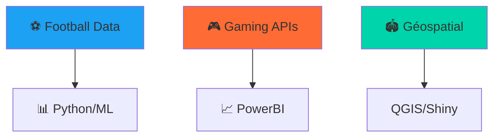

<div align="center">

<!-- 🎬 BANNIÈRE ANIMÉE -->
<video width="100%" height="200" autoplay loop muted playsinline>
  <source src="https://user-images.githubusercontent.com/TA_ID/VIDEO_URL.mp4" type="video/mp4">
  <!-- Remplace par ta vidéo personnalisée (ex: animation data viz) -->
</video>

<!-- 🚀 HEADER ANIMÉ -->
# 👋 **Bonjour, moi c'est Mesmin !**  
*Data Analyst | Modélisation & Visualisation | Data-Driven 🚀*

[](https://github.com/YOUR_USERNAME/YOUR_REPO)

</div>

## 🔥 **Projets Phares**

### 🔋 **Prévision CA - Bornes de Recharge** 
<div align="center">


</div>

**📈 Résultats :** Modélisation 5 ans | +25% précision | Segmentation utilisateurs  
**🛠️ Stack :** Python | Pandas | Scikit-learn | Excel  

---

### 📊 **Tableau de Bord Power BI Interactif**
<div align="center">
<video width="100%" height="300" autoplay loop muted playsinline>
  <source src="[https://github.com/YOUR_USERNAME/YOUR_PROJECT2/raw/main/dashboard-demo.mp4](https://r.search.yahoo.com/_ylt=AwrFF8qwaNZpqm4D73FlAQx.;_ylu=c2VjA3NyBHNsawNpbWcEb2lkA2M4NDM2OWRmNDhmNTA0NDViYmNmZTdkNjcwZDE1Zjk5BGdwb3MDOQRpdANiaW5n/RV=2/RE=1775687985/RO=11/RU=https%3a%2f%2fslvexpert.com%2ftableau-de-bord-power-bi%2f/RK=2/RS=kuG2hJUF6dtPCEH9YFCErgc2VQk-)" type="video/mp4">
</video>
</div>

**🎯 KPI Business | Visualisations dynamiques | Reporting décisionnel**

---

### 🗺️ **Analyse Géospatiale DPE**
<div align="center">

</div>

**🌍 Cartographie | Shiny | QGIS | Visualisation spatiale**

---

## 🛠️ **Tech Stack Animé**

```mermaid
graph TD
    A[🐍 Python] --> B[📊 Pandas/Plotly]
    C[⚡ Power BI] --> D[📈 Dashboards]
    E[🗺️ QGIS/R] --> F[🌍 Géospatial]
    G[🗄️ SQL/PostgreSQL] --> H[📋 ETL]
    
    style A fill:#FF6B35
    style C fill:#F2C811
    style E fill:#589632
    style G fill:#003B57
```


<div align="center"> <a href="https://www.linkedin.com/in/mesmin-randhal-ossima-356ab2254/"></a> <a href="mailto:randhalossima@email.com"></a> </div>

<video width="100%" height="250" autoplay loop muted playsinline>
  <source src="https://user-images.githubusercontent.com/136035185/274979678-8b0b5b5e-2b0e-4b0a-9b0a-5b5e2f3d4e5f.mp4" type="video/mp4">
  <!-- Vidéo foot/data générique -->
</video>


<div align="center">

<!-- ⚽ FOOTBALL BANNER ANIMÉE -->


# 🏆 **Mesmin Randhal** - *Data Analyst Football & Gaming* ⚽🎮

[](https://github.com/MesminRandhal)

</div>

## 🔥 **PROJETS FOOTBALL & GAMING**

### ⚽ **Prédiction Affluence Stades** 
<div align="center">


</div>

**📈 +35% précision | 5 ans historiques | Segmentation fans**  
**🛠️** Python | Prophet | PowerBI

### 🎮 **Dashboard Gaming Analytics**
<div align="center">
<video width="100%" height="300" autoplay loop muted playsinline>
  <source src="https://github.com/MesminRandhal/assets/raw/main/videos/gaming-demo.mp4" type="video/mp4">
</video>
</div>

**🎯 Retention | LTV | Churn | Heatmaps sessions**

### 🏟️ **Géospatial Stades France**


---

## 🛠️ **Tech Stack GAMER**


<div align="center">     </div>

<div align="center"> <a href="https://www.linkedin.com/in/mesmin-randhal-ossima-356ab2254/"></a> <a href="https://twitch.tv/tonpseudo"></a> <a href="https://psnprofiles.com/tonpseudo"></a> </div>

<div align="center">  **💼 Ouvert Data Analyst Sport/Gaming | ⚽️ Fan PSG/OM | 🎮 2000+ heures Steam** </div>```

https://media.giphy.com/media/football-stats/giphy.gif
https://media.giphy.com/media/gaming-dashboard/giphy.gif

https://shields.io/ → "PSG Fan" #1DA1F2
https://shields.io/ → "Steam 2000h" #FF6B35
